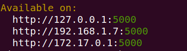
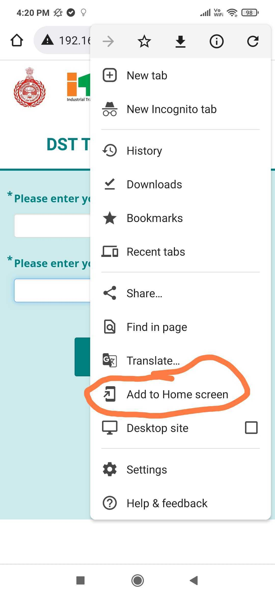
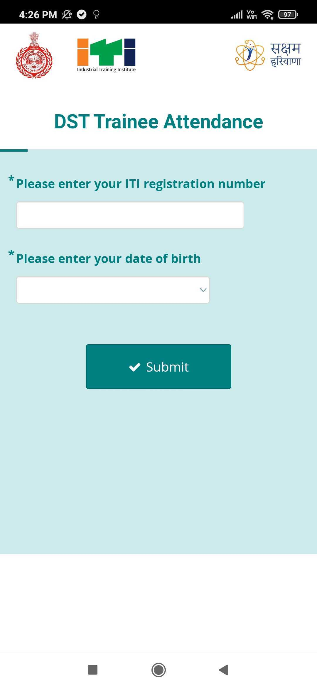

<p align="center">
  <h1>DST - PWA</h1>
</p>
In the project directory, you can run:

### Node installation

You can download node packages from the official site https://nodejs.org/en/download/

Please select the download package as per your OS requirement

```Preferred version is v14.x```

### React version
Version: v17.0.2

### Yarn installation
-> Install via npm

It is recommended to install Yarn through the npm package manager, which comes bundled with Node.js when you install it on your system.

Once you have npm installed you can run the following both to install and upgrade Yarn:

### `npm install --global yarn` || `npm install yarn`

-> To install packages to below:
### `yarn install`

### Create .env file
 - Create ```.env``` file 
   
 - Copy  ```.env.sample``` and paste into ```.env``` 

 - Modify data value as needed

-> After all installation done you can run
### `yarn start`

### Check app working as PWA in local

- Generate build using below:
  
   ```yarn build```

- Go to `build` folder

- Run ```http-server -p 5000 -C1```


   ``Note:  you can change port your choice instead of 5000``

- Available option to run project:

 

- There is an option to add the home screen to mobile and web

 

 

